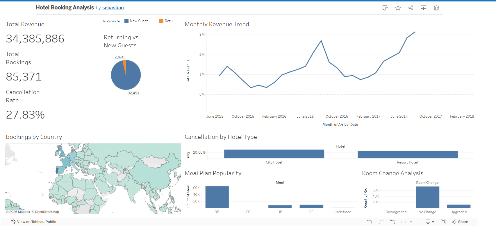

# 🏨 Hotel Booking Demand Analytics
### End-to-End Data Analysis with Python & Tableau Public

<p align="left">


</p>

An end-to-end data analytics project that explores **hotel booking behavior**, **customer trends**, **seasonality**, **cancellations**, and **revenue patterns** using **Python** for data preparation and **Tableau Public** for interactive business intelligence dashboards.

---

# 📊 Dashboard Overview

<p align="center">
<a href="https://public.tableau.com/app/profile/sebastian8348/viz/shared/65CY3FN5B">

</a>
</p>

<p align="center">

### 🔗 Live Interactive Dashboard

**https://public.tableau.com/app/profile/sebastian8348/viz/shared/65CY3FN5B**

*(Click the dashboard image above to open the interactive Tableau dashboard.)*

</p>

---

# 📌 Business Problem

Hotels generate thousands of booking records every year, but raw transactional data alone provides limited business value.

This project transforms hotel booking data into meaningful business insights by identifying booking patterns, customer behavior, revenue trends, and cancellation risks that can support data-driven decision making.

The analysis focuses on answering questions such as:

- When is hotel demand highest?
- Which hotel type performs better?
- Which customer segments generate the most bookings?
- What factors contribute to booking cancellations?
- How can hotels improve occupancy and revenue?

---

# 📂 Dataset

**Dataset:** Hotel Booking Demand

The dataset contains **119,390 hotel bookings** from both **City Hotels** and **Resort Hotels**, including information such as:

- Hotel Type
- Booking Status
- Lead Time
- Stay Duration
- Customer Demographics
- Market Segment
- Meal Plan
- Room Type
- Average Daily Rate (ADR)
- Special Requests
- Parking Requirements

Dataset Source:

https://www.kaggle.com/datasets/jessemostipak/hotel-booking-demand

---

# 🛠 Tech Stack

| Category | Tools |
|----------|-------|
| Programming | Python |
| Data Analysis | Pandas, NumPy |
| Visualization | Matplotlib |
| Dashboard | Tableau Public |
| Development | Jupyter Notebook |

---

# 🔄 Project Workflow

## 1️⃣ Data Cleaning

Performed data quality checks and preprocessing by:

- Removing duplicate records
- Handling missing values
- Correcting invalid bookings
- Validating data consistency
- Preparing the dataset for analysis

---

## 🔄 Feature Engineering

The following features were derived from existing columns to 
support deeper analysis and more meaningful visualizations:

| Feature | Derivation | Purpose |
|---|---|---|
| `total_nights` | `stays_in_weekend_nights + stays_in_week_nights` | Total length of stay per booking |
| `total_guests` | `adults + children + babies` | Total number of guests per booking |
| `total_revenue` | `adr × total_nights` | Estimated revenue per booking |
| `arrival_date` | Combined `year + month + day` columns | Proper datetime for time-based analysis |
| `YearMonth` | Extracted from `arrival_date` | Monthly grouping for trend analysis |
| `arrival_day` | Extracted from `arrival_date` | Day of week analysis |
| `is_room_upgraded` | `reserved_room_type != assigned_room_type` | Whether guest received a different room |
| `room_change` | Comparison of room tier rankings | Classifies room change as Upgraded, Downgraded, or No Change |
| `reserved_room_tier` | Alphabetical ranking of room types (A=1 to H=8, L=9) | Numerical room tier for upgrade/downgrade comparison |
| `assigned_room_tier` | Same ranking applied to assigned room | Paired with reserved tier for direction of change |
| `is_agent_booking` | `agent != 0` | Flags bookings made through a travel agent |
| `is_company_booking` | `company != 0` | Flags bookings made through a corporate account |

### Key Engineering Decisions

**Room Change Classification**
Rather than simply flagging whether a room changed, we assigned 
numerical tiers to each room type (A through L) to determine the 
**direction** of the change — distinguishing between upgrades and 
downgrades. This revealed a 21:1 upgrade-to-downgrade ratio that 
a simple boolean flag would have missed.

**Revenue Estimation**
Since the dataset contains ADR (Average Daily Rate) rather than 
total revenue, `total_revenue` was engineered by multiplying ADR 
by total nights stayed. This enabled meaningful revenue analysis 
at the booking level.

**Booking Channel Flags**
`is_agent_booking` and `is_company_booking` were created as 
boolean flags to simplify segmentation analysis. A value of 0 
in the `agent` or `company` columns was treated as a direct 
booking — enabling clear comparison between booking channels.
---

## 3️⃣ Exploratory Data Analysis (EDA)

Performed exploratory analysis to uncover booking behavior and customer trends.

The analysis covers:

- Booking Trends
- Revenue Analysis
- Cancellation Analysis
- Customer Segmentation
- Hotel Performance
- Seasonal Demand
- Booking Channels
- Meal Preferences

---

## 4️⃣ Tableau Dashboard

Developed an interactive dashboard in **Tableau Public** to communicate key business insights through intuitive visualizations.

Dashboard Features:

- 📈 Revenue Trend Analysis
- 🏨 Hotel Performance Comparison
- ❌ Booking Cancellation Analysis
- 👥 Customer Segmentation
- 📅 Monthly Booking Trends
- 💰 Average Daily Rate (ADR)
- 📊 Booking Distribution
- 🎛 Interactive Filters

---

## 💡 Key Business Insights

### 📅 Seasonality & Demand
✔ **August is the peak arrival month** with 11,069 bookings — 
  2.4x more than January (4,553), the quietest month, confirming 
  a strong summer-driven demand pattern.

✔ **Monday is the busiest arrival day** with 13,869 arrivals, 
  likely driven by corporate travelers checking in at the start 
  of the working week.

✔ **Revenue grows consistently year-over-year** — August 2015 
  generated £1.4M, growing to £2.7M in 2016 (+91%) and £3.1M 
  in 2017 (+16%).

### ❌ Cancellations
✔ **27.83% overall cancellation rate** — significantly above the 
  20% industry benchmark, representing a major revenue risk.

✔ **City Hotel cancellation rate (30.44%) is 6.69 percentage 
  points higher** than Resort Hotel (23.75%), suggesting 
  business travelers and OTA bookings contribute to higher 
  cancellations at city properties.

### 👥 Customer Behavior
✔ **96.58% of guests are first-time visitors** — well below the 
  15-20% returning guest industry benchmark, indicating a 
  significant loyalty program opportunity.

✔ **Average stay duration is 3.67 nights** with 75% of guests 
  staying 5 nights or less, confirming the hotel caters 
  primarily to short-stay travelers.

✔ **Average booking lead time is 50 days** (median) — though 
  the mean is pulled to 80.6 days by outliers, suggesting 
  most guests plan approximately 7 weeks ahead.

### 📊 Booking Channels
✔ **86.78% of bookings come through travel agents** — creating 
  heavy dependency on third-party channels and reducing profit 
  margins through commission fees.

✔ **Only 7.74% of bookings are direct** — a significant missed 
  opportunity since direct bookings carry no commission costs.

### 🍽️ Operations
✔ **Bed & Breakfast (BB) accounts for 77.8% of all meal plan 
  selections** — guests strongly prefer breakfast-only packages 
  while dining outside the hotel for other meals.

✔ **Only 8.44% of guests require parking** — suggesting most 
  guests arrive by public transport, plane, or taxi, presenting 
  an opportunity to partner with transportation services.

✔ **13.43% of guests received a room upgrade** while only 0.63% 
  were downgraded — a 21:1 upgrade-to-downgrade ratio reflecting 
  strong operational consistency.

---

# 📁 Repository Structure

```text
Hotel-Booking-Demand-Analytics
│
├── data/
│   ├── hotel_bookings.csv
│   └── cleaned_hotel_bookings.csv
│
├── notebook/
│   └── hotel_booking.ipynb
│
├── images/
│   └── dashboard-overview.png
│
└── README.md
```

---

# 🚀 Skills Demonstrated

- Data Cleaning
- Data Validation
- Exploratory Data Analysis (EDA)
- Feature Engineering
- Business Analytics
- Data Visualization
- Dashboard Design
- Storytelling with Data
- Python Programming
- Tableau Public

---

# 📈 Tableau Dashboard

### 🌐 Live Dashboard

https://public.tableau.com/app/profile/sebastian8348/viz/shared/65CY3FN5B

### 📊 Tableau Public Profile

https://public.tableau.com/app/profile/sebastian8348/vizzes

---

## 👨‍💻 About Me

**Sebastian Berto**
IT Graduate | Aspiring Data Analyst | Bandung, Indonesia

I am an IT graduate with hands-on experience in data cleaning, 
exploratory data analysis, feature engineering, and dashboard 
development. Currently building a data analytics portfolio 
targeting Junior Data Analyst and Reporting Analyst roles in 
Indonesia's growing tech industry.

### 🛠 Technical Skills
- **Languages:** Python, SQL
- **Libraries:** pandas, matplotlib
- **Databases:** MySQL
- **Visualization:** Google Looker Studio, Tableau Public
- **Tools:** Jupyter Notebook, VS Code, Git, GitHub
- **Office:** Microsoft Excel, PowerPoint, Word

### 📂 Portfolio Projects

| Project | Tools | Link |
|---|---|---|
| UK E-Commerce Sales Analysis | Python, pandas, matplotlib, Looker Studio | [GitHub](https://github.com/xaphirez/ecommerce-analysis) |
| Hotel Booking Demand Analytics | Python, pandas, matplotlib, Tableau | This repository |

### 🤝 Connect With Me

💼 **LinkedIn:** https://www.linkedin.com/in/sebastian-berto/

📊 **Tableau Public:** https://public.tableau.com/app/profile/sebastian8348/vizzes

💻 **GitHub:** https://github.com/xaphirez

📧 **Email:** sebastianberto007@gmail.com

---

*Open to Junior Data Analyst, Reporting Analyst, and Business 
Intelligence Analyst opportunities in Indonesia.*
---

## ⭐ If you found this project interesting, feel free to star the repository and connect with me on LinkedIn!
